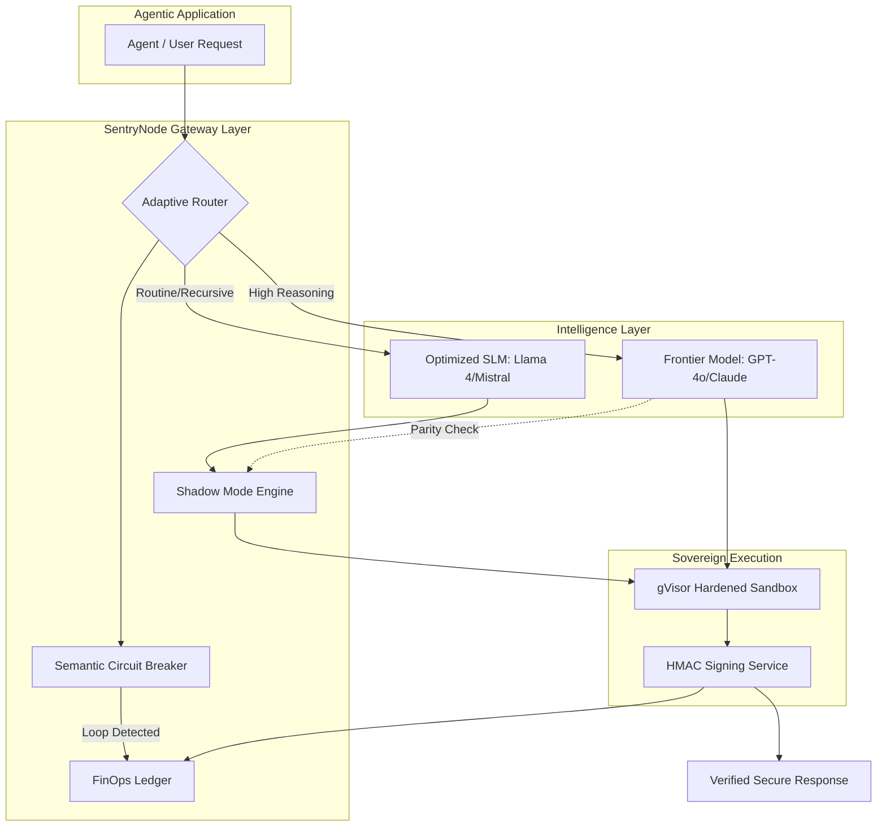

```mermaid
graph TB
    subgraph Client_Layer [Agentic Application]
        A[Agent / User Request]
    end

    subgraph SentryNode_Core [SentryNode Gateway Layer]
        B{Adaptive Router}
        C[Semantic Circuit Breaker]
        D[FinOps Ledger]
        E[Shadow Mode Engine]
    end

    subgraph Model_Tier [Intelligence Layer]
        F[Frontier Model: GPT-4o/Claude]
        G[Optimized SLM: Llama 4/Mistral]
    end

    subgraph Security_Tier [Sovereign Execution]
        H[gVisor Hardened Sandbox]
        I[HMAC Signing Service]
    end

    %% Workflow Connections
    A --> B
    B -- "High Reasoning" --> F
    B -- "Routine/Recursive" --> G
    
    %% Governance Loop
    G --> E
    F -.->|Parity Check| E
    
    %% Guardrails
    B --> C
    C -->|Loop Detected| D
    
    %% Final Output
    E --> H
    F --> H
    H --> I
    I --> J[Verified Secure Response]
    
    %% FinOps Reporting
    I --> D
```
