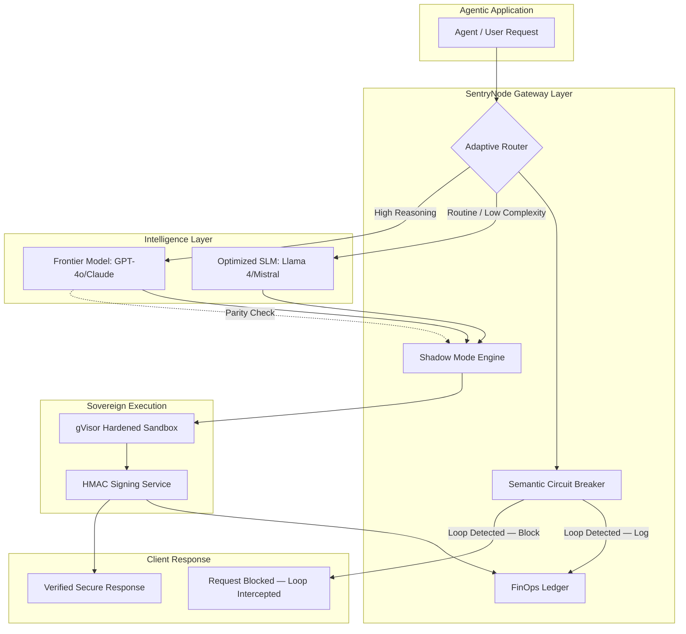

```mermaid
graph TB
    subgraph Client_Layer [Agentic Application]
        A[Agent / User Request]
    end
    subgraph SentryNode_Core [SentryNode Gateway Layer]
        B{Adaptive Router}
        C[Semantic Circuit Breaker]
        D[FinOps Ledger]
        E[Shadow Mode Engine]
    end
    subgraph Model_Tier [Intelligence Layer]
        F[Frontier Model: GPT-4o/Claude]
        G[Optimized SLM: Llama 4/Mistral]
    end
    subgraph Security_Tier [Sovereign Execution]
        H[gVisor Hardened Sandbox]
        I[HMAC Signing Service]
    end
    subgraph Output_Layer [Client Response]
        J[Verified Secure Response]
        K[Request Blocked — Loop Intercepted]
    end

    %% Workflow Connections
    A --> B
    B -- "High Reasoning" --> F
    B -- "Routine / Low Complexity" --> G

    %% Governance Loop
    B --> C
    C -->|Loop Detected — Block| K
    C -->|Loop Detected — Log| D

    %% Shadow Mode Parity
    G --> E
    F -.->|Parity Check| E

    %% Final Output Path — both models flow through Shadow then Sandbox
    F --> E
    E --> H
    H --> I
    I --> J

    %% FinOps Reporting
    I --> D
```
